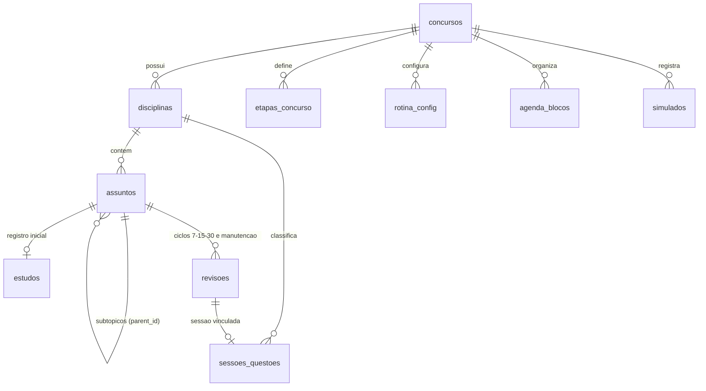

# Modelo de Dados — Preparação BACEN Técnico

Este documento descreve as tabelas, tipos de dados, chaves primárias e relacionamentos do banco de dados (SQLite local e compatível com Supabase/PostgreSQL).

---

## 1. Diagrama de Relacionamento (Mermaid)

---

## 2. Descrição das Tabelas

### `concursos`
Armazena as definições do certame ativo.
- `id` (TEXT, PK): Identificador estável (ex: `bacen-2013-tecnico-area-1`).
- `nome`, `orgao`, `banca`, `edital_numero`: Identificação oficial.
- `cargo`, `area`, `escolaridade`: Cargo disputado.
- `remuneracao_inicial` (REAL): Valor do subsídio inicial em R$.
- `jornada_horas` (INT): Carga horária semanal (40h).
- `data_prova` (TEXT, YYYY-MM-DD): Data oficial da prova.
- `data_prova_estimada` (INT): 0 para confirmada pelo edital, 1 para estimada pelo usuário.

### `etapas_concurso`
Regras oficiais das fases do concurso.
- `id` (TEXT, PK)
- `concurso_id` (TEXT, FK): Referência a `concursos(id)`.
- `nome`: Ex: `(P1) Prova Objetiva Conhecimentos Básicos`.
- `tipo`: `objetiva_c_e`, `discursiva`, `capacitacao`.
- `quantidade_itens`: 60 para P1, 60 para P2, 1 para P3.
- `pontuacao_maxima` / `pontuacao_minima`: Mínimos eliminatórios oficiais.
- `regras_pontuacao` (TEXT, JSON): Fórmulas de cálculo CESPE.

### `disciplinas`
Agrupamento programático (Básicos e Específicos).
- `id` (TEXT, PK)
- `concurso_id` (TEXT, FK)
- `grupo`: `Conhecimentos Básicos` ou `Conhecimentos Específicos`.
- `nome`: Nome da matéria.
- `ordem`: Ordem de exibição.
- `peso`: Peso oficial atribuído.

### `assuntos`
Árvore programática de tópicos e subtópicos fiéis ao edital.
- `id` (TEXT, PK): Slug estável e único.
- `disciplina_id` (TEXT, FK): Referência a `disciplinas(id)`.
- `parent_id` (TEXT, FK NULL): Auto-relacionamento para hierarquia em árvore.
- `codigo_edital`: Numeração do edital (ex: `1`, `1.1`, `10.5.1`).
- `titulo`: Texto do tópico.
- `nivel`: 1 para tópico raiz da disciplina, 2 para subtópico, 3 para detalhe.
- `trecho_original_edital`: Texto ipsis litteris do edital.
- `pagina_edital`: Página do edital onde o tópico está impresso.
- `is_sugestao_estudo`: 0 se oficial do edital; 1 se for decomposição sugerida pela IA.

### `estudos`
Registro do primeiro contato / estudo inicial de cada tópico folha.
- `id` (TEXT, PK)
- `assunto_id` (TEXT, FK UNIQUE): Um estudo por assunto.
- `concluido` (INT): 1 para concluído, 0 para pendente.
- `data_estudo` (TEXT, YYYY-MM-DD): Data em que o estudo foi realizado.
- `tempo_minutos` (INT): Minutos dedicados.
- `anotacoes`, `materiais`: Notas e referências do estudante.

### `sessoes_questoes`
Histórico de questões praticadas (treinos, revisões ou simulados).
- `id` (TEXT, PK)
- `disciplina_id` (TEXT, FK)
- `assunto_id` (TEXT, FK NULL)
- `revisao_id` (TEXT, NULL): Se vinculada a uma revisão específica.
- `data` (TEXT, YYYY-MM-DD)
- `total_questoes` (INT, NOT NULL, > 0)
- `acertos` (INT, NOT NULL, >= 0 e <= total)
- `erros` (INT, NOT NULL, total - acertos)
- `taxa_acerto` (REAL, acertos / total)
- `origem`, `observacoes`: Detalhes da fonte.
- `tipo`: `estudo_inicial`, `revisao`, `treino_avulso`, `simulado`.

### `revisoes`
Ciclos de repetição espaçada e manutenção recorrente.
- `id` (TEXT, PK)
- `assunto_id` (TEXT, FK)
- `ciclo`: `7d`, `15d`, `30d`, `manutencao`, `recuperacao`.
- `numero_ciclo_manutencao` (INT): Contador de ciclo de manutenção (1, 2, 3...).
- `data_prevista` (TEXT, YYYY-MM-DD)
- `data_real` (TEXT, NULL)
- `status`: `agendada`, `disponivel`, `atrasada`, `concluida`, `recuperada`.
- `intervalo_dias` (INT): Intervalo utilizado para calcular a data.
- `sessao_questao_id` (TEXT, FK NULL): Sessão de questões associada.
- `revisoes_substituidas_ids` (TEXT, JSON array): IDs das revisões unificadas se for recuperação.
- `heuristica_intervalo_motivo` (TEXT): Explicação transparente do motivo do intervalo atribuído.

### `rotina_config`
Configurações da rotina do usuário e parâmetros de manutenção.
- `id` (TEXT, PK, 'config_padrao')
- `dias_semana_disponiveis` (JSON): Array de números [1,2,3,4,5,6].
- `minutos_por_dia` (JSON): Mapeamento dia -> minutos disponíveis.
- `duracao_bloco_minutos`, `pausa_minutos`: Duração dos blocos.
- `proporcao_estudo_novo`, `proporcao_revisoes`, `proporcao_questoes`: Pesos de distribuição.
- `faixa_baixo_acerto_dias`, `faixa_medio_acerto_dias`, `faixa_alto_acerto_dias`: Limiares em dias.

### `agenda_blocos`
Blocos diários de estudo gerados pelo algoritmo.
- `id` (TEXT, PK)
- `concurso_id` (TEXT, FK)
- `data` (TEXT, YYYY-MM-DD)
- `duracao_minutos` (INT)
- `disciplina_id`, `assunto_id`, `revisao_id`: Vínculos.
- `tipo`: `estudo_inicial`, `revisao`, `questoes`, `simulado`.
- `status`: `pendente`, `concluido`, `reagendado`.
- `fixado` (INT): 1 se o usuário travou o bloco (nunca movido na reprogramação).
- `motivo_prioridade`: Motivo pelo qual o bloco foi priorizado.

### `simulados`
Registros de simulados com notas líquidas oficiais CESPE.
- `id` (TEXT, PK)
- `titulo`, `data`, `tempo_gasto_minutos`
- `itens_certos_p1`, `itens_errados_p1`, `itens_branco_p1`, `nota_p1_liquida`
- `itens_certos_p2`, `itens_errados_p2`, `itens_branco_p2`, `nota_p2_liquida`
- `nota_total_liquida`, `aprovado_minimos`
- `nota_discursiva`, `discursiva_aprovada`, `observacoes`

### `backup_logs`
Histórico de exportações e restaurações com hashes SHA-256.
